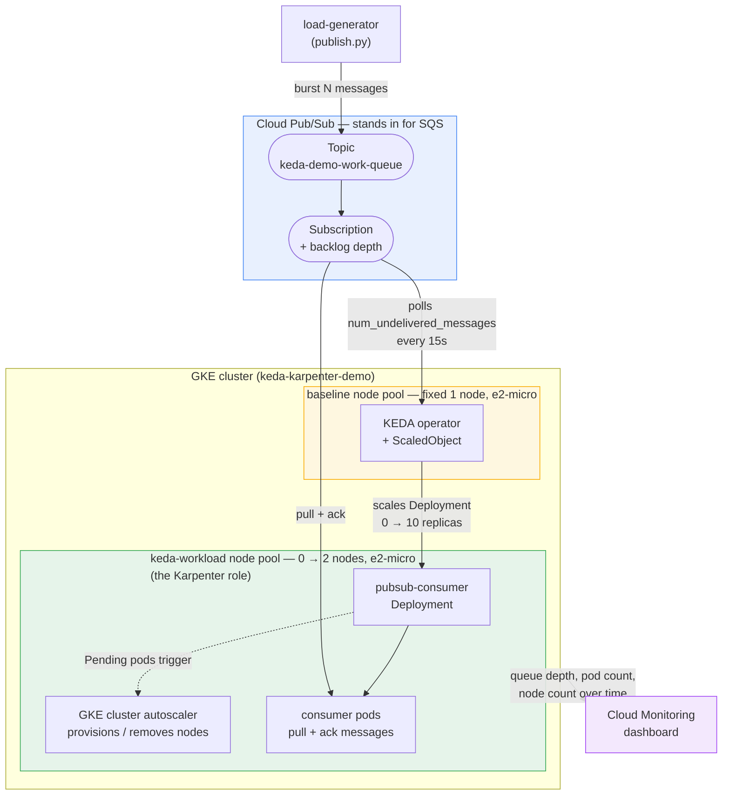

# keda-karpenter-gke-demo

A working demo of the "SQS backlog triggers KEDA, which triggers Karpenter,
which scales nodes 0→N→0" pattern — built and run entirely on **GCP**
because that's what I had access to, not AWS. The architecture maps
directly; only the managed-service names change.

## Architecture



Everything below `KEDA` in the `keda-workload` box is **0 nodes / $0 compute**
at rest. A burst of messages is what temporarily materializes it, and it
disappears again once the queue drains and the cooldown period passes.

## AWS → GCP mapping

| AWS (the scenario this demos) | GCP (what's actually running here) |
|---|---|
| EKS | GKE Standard, zonal cluster |
| SQS | Cloud Pub/Sub (topic + subscription) |
| KEDA on EKS | KEDA on GKE (unchanged — KEDA is Kubernetes-native) |
| Karpenter | GKE cluster autoscaler on a dedicated 0→2 node pool ([terraform/karpenter](terraform/karpenter) has notes on running literal Karpenter-for-GKE instead) |
| IRSA | GKE Workload Identity |
| CloudWatch | Cloud Monitoring |

## How the demo works

1. `app/load-generator/publish.py` bursts ~200 messages into the Pub/Sub
   topic (`keda-demo-work-queue`), simulating a spike in incoming SQS
   traffic.
2. KEDA's `gcp-pubsub` scaler (`k8s/keda-scaledobject-pubsub.yaml`) polls the
   subscription's undelivered-message count every 15s and scales the
   `pubsub-consumer` Deployment from 0 up to 10 replicas (1 pod per 10
   backlogged messages).
3. Those pods are unschedulable on the empty `keda-workload` node pool, so
   GKE's cluster autoscaler provisions nodes for them — this is the role
   Karpenter plays on EKS.
4. The consumer pods drain the queue (each message takes ~5s to simulate
   work) and ack each message.
5. Once the subscription is empty for `cooldownPeriod` (60s), KEDA scales
   the Deployment back to 0 replicas.
6. With no pods left requesting resources, the cluster autoscaler removes
   the now-empty nodes from `keda-workload` back down to 0.
7. Idle-state cost: one `e2-micro` baseline node (covered by GCP's Always
   Free tier in `us-central1`) + Pub/Sub + Artifact Registry, all pay-per-use
   and negligible at this volume. The zonal cluster's management fee is
   waived (one free zonal cluster per billing account). Everything else is
   $0 when there's no traffic.

Watch it happen on the Cloud Monitoring dashboard Terraform creates
(`terraform output monitoring_dashboard_url`): queue backlog, node count,
and pod count all rise together and fall back to zero together.

## Repo layout

```
terraform/           # GKE cluster, node pools, Pub/Sub, Workload Identity, KEDA helm release, dashboard
terraform/karpenter/  # notes on running literal Karpenter-for-GKE instead of the native autoscaler
k8s/                  # consumer Deployment + KEDA TriggerAuthentication/ScaledObject
app/consumer/         # Python service that pulls from Pub/Sub and simulates work
app/load-generator/   # script that bursts messages in to trigger a scale-up
scripts/up.sh          # one-shot end-to-end provision + deploy
scripts/down.sh        # one-shot full teardown
.github/workflows/    # terraform plan/apply CI, and build/push/deploy for the consumer image
```

## Running it yourself

Prerequisites: a GCP project with billing enabled, `gcloud`, `terraform`,
`kubectl`, `docker`.

```bash
# One-time: GCS bucket for terraform state (name must be globally unique)
gsutil mb -l us-central1 gs://<your-project-id>-keda-demo-tfstate

# Edit terraform/backend.tf and terraform/variables.tf defaults to your project ID

PROJECT_ID=<your-project-id> ./scripts/up.sh
```

That provisions everything and deploys the consumer image. Then trigger the
demo and watch it scale:

```bash
pip install -r app/load-generator/requirements.txt
python app/load-generator/publish.py --project <project-id> --topic keda-demo-work-queue --count 200

watch kubectl get pods -n keda-demo
watch kubectl get nodes -l cloud.google.com/gke-nodepool=keda-workload
```

When you're done:

```bash
PROJECT_ID=<your-project-id> ./scripts/down.sh
```

## CI/CD

- **`terraform-plan-apply.yml`** — `terraform plan` on PRs touching
  `terraform/**`, `terraform apply` on merge to `main`. Authenticates via
  Workload Identity Federation (OIDC) — no service-account JSON key is ever
  stored as a GitHub secret.
- **`build-push-deploy.yml`** — builds the consumer image, pushes to
  Artifact Registry, applies the k8s manifests.

Both workflows need two repo variables set (`Settings → Secrets and
variables → Actions → Variables`), which come from Terraform's own output:

```bash
terraform output workload_identity_provider   # -> WIF_PROVIDER
terraform output github_actions_service_account  # -> WIF_SERVICE_ACCOUNT
```

## Teardown

`scripts/down.sh` deletes pushed container images (Terraform can't remove a
non-empty Artifact Registry repo) and then runs `terraform destroy` —
removing the cluster, node pools, Pub/Sub, IAM/Workload Identity, Artifact
Registry, and the monitoring dashboard. Brings the project back to $0.

## Screenshots

Captured from a live run — see [docs/screenshots](docs/screenshots).
